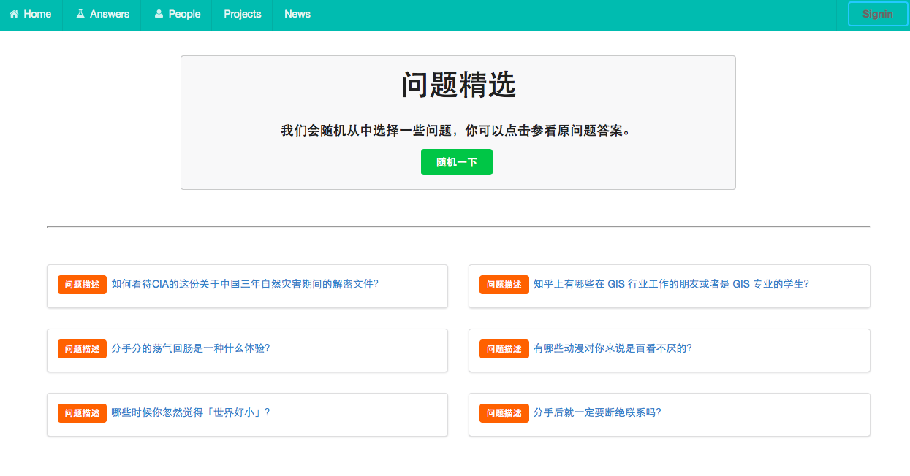
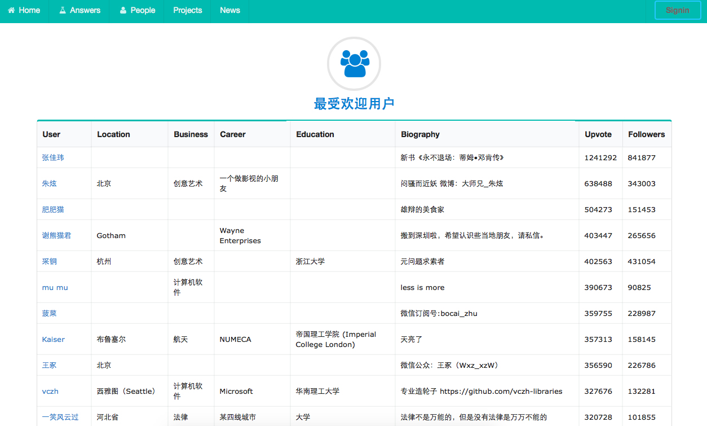

# README

I used Ruby on Rails to build a web application.  The data of this project is crawled by the project **spider_for\_zhihu**.

## How to run
First, you should install the requirements, including:

+ Ruby >= 2
+ Rails >= 4.2.1
+ rvm (recommend)
+ MySQL

and the gems listed in the **Gemfile**. Running this project also needs the data which is stored in MySQL. If all requirements satisfied, you should tap ``rails s`` and open ``http://localhost:3000 ``

## Demo

This projects looks like

--

